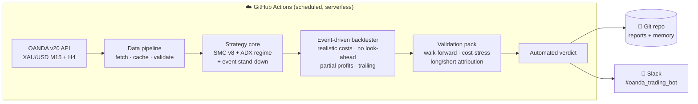

<div align="center">

# 🪙 Gold SMC v8 — Autonomous XAU/USD Backtesting & Validation Engine

**A cloud-native, self-running research system that pressure-tests a Smart-Money-Concepts gold strategy against real OANDA data — and is engineered to tell the truth, not to flatter the strategy.**


</div>

---

## Overview

This repository implements a **fully autonomous backtesting and validation pipeline** for a discretionary-style *Smart Money Concepts* (SMC) strategy on **spot gold (XAU/USD)**, executed on **OANDA** market data. It runs entirely in the cloud on **GitHub Actions** — fetching data, running the strategy, validating it out-of-sample, committing results back to the repository, and posting a verdict to **Slack** — with **zero local infrastructure** and no machine left running.

The defining design principle is **intellectual honesty**. Most retail backtests are optimistic fiction (bar-close fills, zero slippage, in-sample curve-fitting). This engine is built to do the opposite: to *try to disprove its own strategy* using the same techniques quantitative desks use — realistic transaction costs, strict no-look-ahead accounting, walk-forward out-of-sample testing, cost-stress analysis, and a long/short decomposition to separate genuine alpha from market beta.

> **Philosophy:** A system that can cheaply *falsify* a bad idea is worth more than one that cheerleads a pretty equity curve.

---

## Why this project is worth a look

- 🧠 **Event-driven backtester with provable integrity** — signals are computed only on closed bars; fills occur on the *next* bar's open. Verified by a unit-test suite (9/9) and a bar-for-bar **parity proof** between the fast vectorized path and the reference implementation.
- 💸 **Realistic cost model** — half-spread + adverse slippage on every fill, pessimistic intrabar resolution (if a bar touches both stop and target, the *stop* fills first).
- 🔬 **Honest validation pack** — walk-forward optimization (in-sample → out-of-sample), cost-stress testing, and long-vs-short attribution, producing a strict, automated **verdict**.
- 📈 **Real strategy logic** — a faithful Python port of a TradingView Pine strategy (displacement, fair-value gaps, NY-opening play) plus a 0–100 confidence gate.
- 🛡️ **Risk & regime intelligence** — ADX trend-regime filter, FOMC/CPI/NFP event stand-down, partial profit-taking with ATR trailing, break-even stop management, daily trade caps.
- ☁️ **Truly serverless** — scheduled GitHub Actions workflows do all the work; state and results are version-controlled in the repo itself.
- 🔔 **Observability** — every run posts a tagged summary to Slack; every weekly review is appended to a persistent `lessons.md`.

---

## Architecture



The backtest and the (future) live path **share one signal implementation**, so there is no divergence between what is tested and what would trade.

---

## The strategy

A faithful port of **Gold SMC v8**, adapted for 24/5 spot gold:

| Component | Logic |
|---|---|
| **Entry triggers** | Displacement candle (body > 1.2×ATR & > 1.5× opposite wick) **OR** Fair-Value Gap (3-bar gap > 0.25×ATR) |
| **Trend filter** | 50-EMA on 4H bars (true higher-timeframe), with M15 fallback during warmup |
| **Regime filter** | 4H **ADX ≥ 20** — no trading in chop |
| **NY-Opening play** | 8:00 & 8:15 ET two-candle directional setup with RSI/VWAP confirmation |
| **Event gate** | Stand down on FOMC / CPI / NFP days |
| **Confidence gate** | 0–100 score (trigger 30 · HTF 20 · volume 15 · NY 10 · macro ±25); trade only if ≥ 60 |
| **Risk** | 1% risk/trade, swing-or-ATR stops, **50% partial at +1R**, break-even move, ATR trailing on the runner, max 3 trades/day |
| **Targets** | 2.5R default, 3.0R for NY-Opening |

---

## Validation methodology (the part that matters)

A backtest number means nothing on its own. This engine subjects every result to four independent honesty checks:

1. **Walk-forward** — parameters are optimized on an in-sample window and judged on the *next, unseen* window. A large in-sample/out-of-sample gap exposes curve-fitting.
2. **Cost-stress** — re-run with widened spread and slippage. If the edge evaporates, it was never real.
3. **Long/short attribution** — if all profit comes from longs during a gold bull market, it's *beta*, not *alpha*. A real edge appears on both sides.
4. **Sample-size gate** — the system refuses to declare a verdict on too few out-of-sample trades.

The automated verdict resolves to one of: **No edge after costs** · **Marginal / regime-dependent** · **Robust-ish** · **Insufficient data**.

---

## Current results

> ⚠️ **Research preview — not investment advice.** Results are from OANDA *practice* (paper) data. No live capital is traded.

Latest validation run (XAU/USD, 2024-06 → 2026-06):

| Check | Result | Read |
|---|---:|---|
| In-sample (367 trades) | PF **1.25**, win **57.5%**, exp **0.11R** | Modest positive base |
| **Cost-stress** PF | **1.14** | ✅ Edge survives realistic costs |
| **Long** PF (247 tr) | **1.33** | ✅ Profitable |
| **Short** PF (120 tr) | **1.16** | ✅ Profitable — *not just long-beta* |
| Out-of-sample (29 tr) | PF 2.12 | ⚠️ Too few trades to trust |
| **Verdict** | **Insufficient data** | More out-of-sample trades needed before any conclusion |

**Honest status:** early, structurally encouraging signals (edge survives cost-stress *and* appears on both directions), but the out-of-sample sample is too small to render a trustworthy verdict. Next step: extend history and widen the walk-forward windows to push out-of-sample trade count above ~100.

---

## How it runs

| Workflow | Schedule | Does |
|---|---|---|
| `backtest.yml` | Mon–Fri 22:00 UTC | Refresh data → full-history backtest → commit → Slack |
| `validate.yml` | Sat 02:00 UTC + on demand | Walk-forward + cost-stress + long/short → **verdict** → Slack |

Trigger on demand from anywhere:

```bash
gh workflow run validate.yml && gh run watch
```

Results land in `reports/` and `memory/` (committed) and in the Slack channel — no laptop required.

---

## Repository structure

```
config.py                     Settings (env-driven; no secrets committed)
data/fetch_oanda.py           OANDA v20 candle downloader
strategy/
  strategy.py                 Reference signal logic (broker-decoupled)
  signals.py                  Vectorized fast path (parity-proven)
  signals_v2.py               + ADX regime filter & event stand-down
  calendar_events.py          FOMC / CPI / NFP calendar
  risk.py · confidence.py     Sizing/stops/targets · 0–100 gate
backtest/
  core.py                     Event-driven engine mechanics (unit-tested)
  engine_final.py             Production engine (base)
  engine_v2.py                + partial profits & ATR trailing
  metrics.py · metrics2.py    Metrics + long/short attribution
  wf.py · validate.py         Walk-forward · full validation pack
main.py · validate_run.py     Orchestrators (routines + Slack + verdict)
execution/notifier.py         Slack Web API client
.github/workflows/            Scheduled cloud automation
tests/                        Engine unit tests + signal parity proof
memory/ · reports/            Version-controlled state & outputs
```

---

## Quickstart (optional — the cloud does this for you)

```bash
pip install -r requirements.txt
cp .env.example .env          # add OANDA_API_KEY
python data/fetch_oanda.py    # download XAU/USD history
python validate_run.py        # run the validation pack + verdict
```

---

## Tech stack

**Python** · **pandas / numpy** (vectorized indicators & event loop) · **OANDA v20 REST API** · **GitHub Actions** (serverless scheduling & CI) · **Slack Web API** · **Git-as-database** (version-controlled state).

---

## Roadmap

- [ ] Extend history & walk-forward windows to reach a statistically conclusive verdict
- [ ] Per-setup pruning driven by live attribution data
- [ ] Monte-Carlo / bootstrap significance testing on the equity curve
- [ ] CFTC COT positioning as an additional gold signal
- [ ] Streamlit equity dashboard
- [ ] Gated live paper loop *only if* out-of-sample edge proves durable

---

## Disclaimer

This is an educational research project. It trades **paper money** on a practice account and makes **no claim of profitability**. Nothing here is financial advice. Markets are adversarial and most strategies have no durable edge; this system exists precisely to test that claim honestly.

<div align="center">

*Built with a bias toward truth over hope.*

</div>
