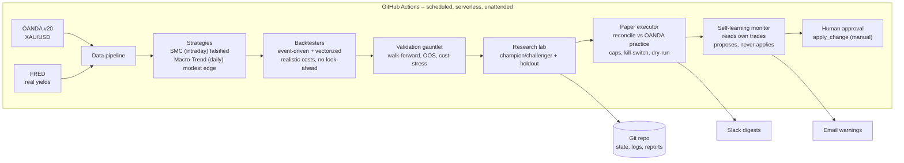

<div align="center">

# Gold Quant Lab

### An autonomous, self-validating quant trading system for spot gold -- engineered to *disprove* its own ideas before trusting them, and to forward-test the survivors on a live paper account.

*A case study in honest quant research: I took a popular retail strategy, proved with rigorous out-of-sample testing that it has no edge, pivoted to a strategy with real academic support, found a modest genuine edge, wrapped it in a guardrailed loop that improves itself without fooling itself, and deployed it to autonomous paper trading with a human-approved self-learning loop.*


-blueviolet)


</div>

---

## TL;DR for a reviewer

A complete quantitative trading platform that runs unattended in the cloud (GitHub Actions) and walks the full professional lifecycle:

**hypothesis -> faithful implementation -> cost-aware event-driven backtest -> out-of-sample / walk-forward validation -> honest verdict -> autonomous guardrailed iteration -> live paper execution -> human-approved self-learning.**

Its defining feature is **what it rejects.** It conclusively falsified an intraday Smart-Money-Concepts strategy (no edge after costs), then surfaced a genuinely positive -- if modest -- edge from a documented risk premium, and now forward-tests it on an OANDA practice account with hard safety rails. Every number is produced under strict no-look-ahead accounting and realistic transaction costs, and the system is built specifically to resist the overfitting that makes most retail backtests worthless.

---

> **Current status (2026-07).** The validated **Macro-Trend champion** runs on the daily paper account -- the only scheduled job. Backtests, validation and the research loop are **on-demand** (run manually when I want them). The exploratory *intraday* paper tracks (SMC / ATR-gated / stack) and the daily coach email were **retired** -- they showed no edge after costs and only added alert noise. This repo keeps what works and nothing that doesn't.

---

## What this project demonstrates (skills)

- **Quant research methodology** -- walk-forward, in/out-of-sample separation, cost-stress, long/short attribution, permanent holdouts, multiple-testing discipline.
- **Backtesting engineering** -- an event-driven engine with provable no-look-ahead behavior, realistic spread/slippage, pessimistic intrabar fills, partial profits + ATR trailing; plus a vectorized path **proven bar-for-bar equivalent** to the reference.
- **Live execution & risk** -- an OANDA v20 paper broker with position reconciliation, a notional/leverage cap, stale-data and kill-switch guards, and dry-run mode.
- **Autonomy & MLOps** -- a self-improving champion/challenger loop with persistent state, anti-overfitting guardrails, a self-learning monitor that reads the bot's own live trades, and Slack + email observability.
- **Software & data engineering** -- modular packages, unit + parity tests, env-driven config, secret hygiene, CI/CD, OANDA + FRED ingestion.
- **Intellectual honesty** -- killing my own strategy when the data said so.

---

## The story

1. **Hypothesis.** Ported a TradingView "Gold SMC v8" strategy (displacement, fair-value gaps, NY-open) faithfully to Python.
2. **Honest test.** Event-driven backtest + walk-forward on 5 years / 534 out-of-sample trades -> **NO EDGE AFTER COSTS** (OOS expectancy -0.016R; 5x cost-stress profit factor < 1.0). The apparent profit was gold beta plus unrealistically cheap fills.
3. **Pivot.** Replaced it with a documented premium: **time-series momentum + a real-yield (TIPS) macro filter + volatility targeting**, on daily bars.
4. **Result.** **REAL (MODEST) EDGE** -- out-of-sample Sharpe that survives 5x costs; reported honestly, a ~0.5 full-sample Sharpe with a ~36% max drawdown, and recent strength flattered by gold's 2023-2026 bull run.
5. **Autonomy.** An on-demand loop tests challengers, applies a **deflated-Sharpe** multiple-testing gate (Bailey & Lopez de Prado) so the best-of-N pick must beat luck-of-N, confirms winners on a permanent holdout, and proposes a switch only after a 3-week streak -- paper track only, human-approved.
6. **Live paper.** A daily executor reconciles the validated champion's target position on an OANDA practice account, behind hard safety rails.
7. **Self-learning.** The bot records its own trades, weekly reviews how the live paper account actually performed versus the backtest, and emails a warning proposing a de-risk or strategy change -- which a human approves before anything changes.

---

## Architecture



---

## Results, reported honestly

| Strategy | Style | Out-of-sample | Cost-stress (5x) | Verdict |
|---|---|---|---|---|
| Gold SMC v8 | Intraday M15 | expectancy -0.016R (534 trades) | PF 0.98 (loses) | NO edge |
| Gold Macro-Trend | Daily TSMOM + real-yield + vol-target | Sharpe ~1.7 | survives | Modest edge |

*Caveat stated plainly:* Macro-Trend's full-sample Sharpe is ~0.5 with a ~36% drawdown; its strong out-of-sample window overlaps gold's recent bull market. The honest expectation is a slow, volatile, modest edge that still needs cross-asset confirmation and live forward-testing.

---

## Full research log -- every strategy tested, and its honest verdict

Beyond the headline SMC-vs-Macro story, the lab ran a wide, deliberately skeptical sweep across
strategies, timeframes and markets. Listing the failures is the point: **rejecting** ideas
cheaply, before any capital, is the product. Full, reproducible write-ups live in [`reports/`](reports/).

| Strategy tested | Market / TF | Honest (selection-period) result | Verdict | Write-up |
|---|---|---|---|---|
| Gold SMC v8 (displacement / FVG / NY) | Gold M15 | -0.016R OOS, PF < 1 at 5x cost | **NO edge** | falsified (see story) |
| Macro-Trend (TSMOM + real-yield + vol-target) | Gold daily | ~0.5 full-sample Sharpe, survives 5x | **Modest edge (champion)** | [bake-off](reports/strategy_bakeoff_2026-07-22.md) |
| FVG+NY + daily-trend "honest router" | Gold M15 | selection Sharpe 0.55, **negative at 3x cost**, 87% long | thin, cost-fragile, loses to buy-and-hold | [rigorous](reports/rigorous_backtest_2026-07-22.md) |
| ATR-volatility-gated stack | Gold M15 | the *only* change that improved validation **and** survived 5x | promising; forward-test only | [robustness](reports/robustness_study_2026-07-25.md) |
| Opening-Range Breakout (ORB) | Gold M15 | negative even frictionless | **NO edge** (doesn't port from stocks) | [ORB verdict](reports/orb_gold_verdict_2026-07-22.md) |
| "Advanced Price Action" (3-drives + wedge) | Gold M15/H1 | flat at scale; a hand-picked-chart mirage | **NO edge** | [APA verdict](reports/apa_verdict_2026-07-23.md) |
| Intraday stack ported to EUR/USD | FX M15 | selection -0.003R, fails the gate | **NO edge** (doesn't port to FX majors) | [FX verdict](reports/fx_port/EUR_USD_verdict_2026-07-26.md) |
| 84 CTA combos x instruments (deflated) | Futures / crypto daily | best deflates to 0.51 < 0.95 | consistent with luck; **deploy nothing** | strat-scan |

**Two discipline artifacts worth calling out:**

- **Honest router vs. the hindsight mirage** -- a deliberately-cheating "best-of-each-week" curve
  (weekly Sharpe ~5, +8,700%) was built *beside* the honest router to show exactly how an overfit
  combination looks, and to prove the honest number can't be contaminated by it. [Report](reports/honest_router_vs_hindsight_2026-07-25.md).
- **Independent verification pass** -- answered a skeptical professional trader's six audit
  questions with reproducible code, a per-trade log, and machine-checked no-look-ahead proofs.
  [Methodology](reports/verification_methodology_2026-07-25.md) - code in [`research/router_audit/`](research/router_audit/), FX port in [`research/fx_port/`](research/fx_port/).

### Deployment readiness (honest, as of 2026-08)

**No strategy has cleared the bar for real capital -- gold, FX, or futures.** The daily
Macro-Trend champion is the one modest, cost-surviving edge, and it forward-trades on **paper
only**; it is currently flat (the signal says stay out). The MGC / Apex combine runs as a
**paper** prop-account simulation on real Databento futures data and has **not yet built a track
record** (it has been flat, taking no trades). Nothing here justifies funding an Apex 50k/100k
account or going live on FX today. Real-money funding stays gated behind: months of forward paper
matching expectations, an explicit human decision, and -- for the operator -- the documented
F-1 / legal clearance steps. **Paper only. Not financial advice.**

---

## Safety model (live paper)

The paper executor is the only component that places orders, and only on the **practice** account. Before any order it enforces: a `STOP` kill-switch file, a stale-data guard, a notional cap (default **1x NAV -- no leverage**), a human-approved guards file, dry-run mode, and try/except around every broker call (errors -> stand down, never act on bad data). It is **locked to the validated champion** and will never trade the research lab's unconfirmed challengers. The self-learning loop can only *propose* changes; **a human applies them.** Real-capital trading is intentionally **not** implemented -- that step requires months of paper results matching expectations and an explicit human decision.

---

## Self-learning loop (human-in-the-loop)

On top of the validated paper bot sits an autonomous self-improvement layer whose defining rule is that **nothing changes the live strategy or its risk without a human approving it.** It watches and proposes; a person applies.

- **Record** -- each weekday the paper trader logs its own position and the decision features behind it to `memory/trade_ledger.json`.
- **Review** -- a weekly job (`learning/monitor.py`) turns that ledger into a real live P&L record and compares live Sharpe, drawdown, and hit-rate against the backtest expectation.
- **Propose + warn** -- if live results breach a guardrail, or the research lab has a challenger that cleared every historical gate, it files a proposal and emails a warning. It never applies the change.
- **Approve** -- a human applies pending proposals by running the manual `oanda-apply-change` workflow. Only then does the champion change, or a de-risk / halt guard take effect.

It is built to resist fooling itself: a daily strategy accrues trades slowly, so a strategy swap still must pass the research lab's permanent holdout, 3-week streak, and 5x cost stress before it can even be proposed, and live data only ever de-risks or vetoes -- it never re-optimizes on a lucky week. Full detail in [LEARNING.md](LEARNING.md).

---

## Repository structure

```
config.py                      Env-driven settings (no secrets committed)
data/  fetch_oanda.py          Intraday candles (M15/H4)
       fetch_daily.py          Daily candles + FRED real yields
strategy/
  strategy.py, signals.py      SMC reference + parity-proven fast path
  signals_v2.py, calendar_events.py   Regime/event gates + macro calendar
  risk.py, confidence.py       Sizing/stops/targets, 0-100 gate
  macro_trend.py               Validated Macro-Trend signal
backtest/
  core.py, engine_final.py, engine_v2.py   Event-driven engines
  metrics.py, metrics2.py      Metrics + long/short attribution
  wf.py, validate.py, macro_backtest.py    Validation suites
execution/
  notifier.py                  Slack client
  oanda_broker.py              OANDA v20 paper broker
learning/                      Self-learning layer (human-in-the-loop)
  ledger.py                    Records the bot's own daily trades + features
  monitor.py                   Weekly live-vs-backtest review; proposes changes
  proposals.py                 Shared proposal store (pending / history)
  emailer.py                   Gmail warning sender (self-learning alerts)
research_lab.py                Champion/challenger loop + deflated-Sharpe gate (proposes)
paper_trader.py                Daily paper executor (locked to champion)
apply_change.py                Human-approved apply step for proposals
main.py, validate_run.py, macro_run.py     Orchestrators
.github/workflows/             backtest, validate, macro_validate, research,
                               paper_trade, learn, apply_change
                               (paper_trade is the only scheduled job; the rest are on-demand)
tests/                         Engine + paper unit tests, signal parity proof
research/, memory/, reports/   Version-controlled state, logs and verdicts
LEARNING.md                    How the self-learning loop works
```

---

## Run it

```bash
pip install -r requirements.txt
cp .env.example .env                       # OANDA_API_KEY (+ OANDA_ACCOUNT_ID for paper)
python data/fetch_daily.py                 # daily gold + real yields
python macro_run.py                        # validated strategy + verdict
python research_lab.py                     # one autonomous research cycle (proposes only)
DRY_RUN=true python paper_trader.py        # simulate a paper reconcile (no orders)
python -m learning.monitor                 # weekly self-review (proposes only)
python apply_change.py --list              # see pending proposals; run without --list to apply
```

Unattended in the cloud, the champion's **daily paper execution** runs on a schedule; the backtests, validation verdict, research loop and self-learning review are kept as **on-demand** workflows (run manually) to conserve runtime and avoid alert noise. Results commit to git and post to Slack; strategy changes wait for a human-triggered apply step.

---

## What I'd do next

- Rolling walk-forward (replace the single in/out split) for the macro strategy.
- Cross-asset confirmation (silver, broad commodities) to prove the premium isn't gold-specific luck.
- Several months of live paper forward-testing vs the backtest expectation before any capital is considered.
- Monte-Carlo / bootstrap significance on the equity curve.

---

## Disclaimer

Educational research on a **paper** account. **Not financial advice.** No strategy here is guaranteed to be profitable; this system exists to test that claim honestly -- and it does, even when the answer is *no*.

<div align="center">

*Built with a bias toward truth over hope.*

</div>
