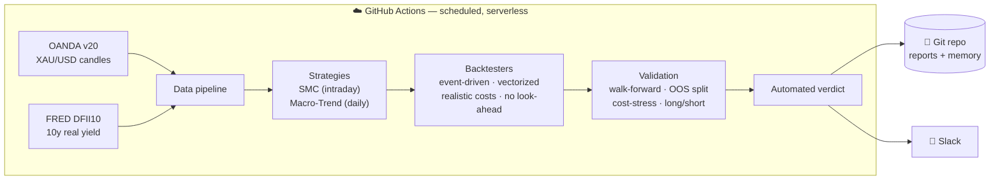

<div align="center">

# 🪙 Gold Quant Lab — Honest Strategy Research & Validation Engine

**A cloud-native quant research system for spot gold (XAU/USD) that designs strategies, then tries its hardest to *disprove* them — using realistic costs, out-of-sample testing, and cost-stress. It has already falsified one strategy and surfaced one with a genuine, documented edge.**


</div>

---

## What this is

A fully autonomous, serverless research lab that runs on **GitHub Actions** — fetching market data, running gold strategies through rigorous backtests, validating them out-of-sample, committing results to the repo, and posting verdicts to **Slack** — with no local infrastructure.

Its defining feature is **intellectual honesty**. Most retail backtests are optimistic fiction. This engine is engineered to do the opposite: subject every strategy to the same gauntlet a quant desk would — realistic transaction costs, strict no-look-ahead accounting, walk-forward / out-of-sample testing, cost-stress analysis, and long-vs-short attribution to separate genuine alpha from market beta.

> **The system's credibility comes from what it rejects, not what it promises.**

---

## Two strategies. One honest verdict each.

| Strategy | Style | Verdict | Evidence |
|---|---|---|---|
| **Gold SMC v8** | Intraday (M15) Smart-Money-Concepts — displacement / FVG / NY-open | ❌ **No edge after costs** | 534 out-of-sample trades, expectancy **−0.016R**, cost-stress PF **0.984** (loses under realistic spreads) |
| **Gold Macro-Trend** | Daily time-series momentum + real-yield (TIPS) filter + volatility targeting | ✅ **Real (modest) edge** | Out-of-sample Sharpe **1.74**, survives **5× costs** (1.69); full-sample Sharpe **0.53**, max drawdown **−36%** |

**Read the second row honestly.** The out-of-sample Sharpe of 1.74 is strong *and survives cost-stress* — a real, documented-style premium (time-series momentum + the gold/real-rate relationship). But the **full-sample** numbers tell the sober truth: a **~0.5 Sharpe with a 36% drawdown**, and the recent out-of-sample window coincides with gold's 2023–2026 bull run, which flatters it. The realistic expectation is a *modest, slow, occasionally-painful* edge — not a money machine. It is, however, the genuine article where SMC was not.

---

## Architecture



---

## The validated strategy — Gold Macro-Trend

Three ingredients, each with real published support:

1. **Time-series momentum** — long when the 50-day EMA > 200-day EMA *and* 12-month momentum is positive; short when both point down. *(Moskowitz–Ooi–Pedersen, 2012.)*
2. **Real-yield filter** — gold's strongest fundamental driver is the 10-year real yield (FRED `DFII10`); bias long when real yields are flat/falling, short when rising.
3. **Volatility targeting** — size to a fixed ~10% annualized volatility, rebalanced as conditions change. *(Moreira–Muir, 2017.)*

Low turnover (~10 trades/year) means transaction costs are negligible — the opposite of the intraday strategy's fatal flaw.

---

## Validation methodology

Every result must clear four independent honesty checks before the engine will call it an edge:

1. **Walk-forward / out-of-sample** — judged on unseen data; a large in-sample/OOS gap exposes curve-fitting.
2. **Cost-stress** — re-run with 5× costs; if the edge dies, it was never real.
3. **Long/short attribution** — a real edge shows on both sides, not just the bull-market direction.
4. **Sample-size gate** — no verdict on too few trades/days.

Verdicts resolve to: **No edge after costs · Marginal · Real (modest) edge · Insufficient data.**

---

## Repository structure

```
config.py                      Env-driven settings (no secrets committed)
data/
  fetch_oanda.py               OANDA intraday candles (M15/H4)
  fetch_daily.py               OANDA daily candles + FRED real yields
strategy/
  strategy.py · signals.py     SMC reference logic + parity-proven fast path
  signals_v2.py                + ADX regime filter & event stand-down
  calendar_events.py           FOMC / CPI / NFP calendar
  risk.py · confidence.py      Sizing/stops/targets · 0–100 gate
  macro_trend.py               ✅ Gold Macro-Trend signal (TSMOM + real-yield + vol target)
backtest/
  core.py · engine_final.py    Event-driven engine (unit-tested) + production wrapper
  engine_v2.py                 + partial profits & ATR trailing
  metrics.py · metrics2.py     Metrics + long/short attribution
  wf.py · validate.py          Walk-forward · full validation pack
  macro_backtest.py            ✅ Daily vectorized backtest + verdict
main.py                        Intraday orchestrator (backtest / weekly review)
validate_run.py                Intraday validation pack entrypoint
macro_run.py                   ✅ Macro-Trend validation entrypoint
execution/notifier.py          Slack Web API client
.github/workflows/             backtest.yml · validate.yml · macro_validate.yml
tests/                         Engine unit tests + signal parity proof
memory/ · reports/             Version-controlled state & verdicts
```

---

## Quickstart (the cloud does this automatically)

```bash
pip install -r requirements.txt
cp .env.example .env                 # add OANDA_API_KEY
python data/fetch_daily.py           # daily gold + real yields
python macro_run.py                  # run the validated strategy + verdict
```

Trigger in the cloud on demand:

```bash
gh workflow run macro_validate.yml && gh run watch
```

---

## Roadmap

- [ ] **Rolling** walk-forward for Macro-Trend (replace the single 60/40 split)
- [ ] Cross-asset confirmation (silver, broad commodities) to prove it's a premium, not gold-luck
- [ ] Forward (paper) test on new data before any capital
- [ ] Monte-Carlo / bootstrap significance on the equity curve
- [ ] Regime overlay (trend vs mean-reversion) and a small live paper loop *only if* it keeps proving out

---

## Tech stack

**Python** · **pandas / numpy** · **OANDA v20 REST** · **FRED** · **GitHub Actions** · **Slack Web API** · **Git-as-database**.

---

## Disclaimer

Educational research on a **paper** account. **Not financial advice.** No strategy here is guaranteed to be profitable; markets are adversarial and most apparent edges are noise. This system exists precisely to test that claim honestly — and it does, even when the answer is "no."

<div align="center">

*Built with a bias toward truth over hope.*

</div>
