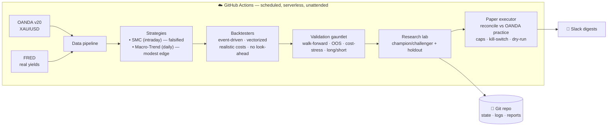

<div align="center">

# 🪙 Gold Quant Lab

### An autonomous, self-validating quant trading system for spot gold — engineered to *disprove* its own ideas before trusting them, and to forward-test the survivors on a live paper account.

*A case study in honest quant research: I took a popular retail strategy, proved with rigorous out-of-sample testing that it has no edge, pivoted to a strategy with real academic support, found a modest genuine edge, wrapped it in a guardrailed loop that improves itself without fooling itself, and deployed it to autonomous paper trading.*


-blueviolet)


</div>

---

## TL;DR for a reviewer

A complete quantitative trading platform that runs unattended in the cloud (GitHub Actions) and walks the full professional lifecycle:

**hypothesis → faithful implementation → cost-aware event-driven backtest → out-of-sample / walk-forward validation → honest verdict → autonomous guardrailed iteration → live paper execution.**

Its defining feature is **what it rejects.** It conclusively falsified an intraday Smart-Money-Concepts strategy (no edge after costs), then surfaced a genuinely positive — if modest — edge from a documented risk premium, and now forward-tests it on an OANDA practice account with hard safety rails. Every number is produced under strict no-look-ahead accounting and realistic transaction costs, and the system is built specifically to resist the overfitting that makes most retail backtests worthless.

---

## What this project demonstrates (skills)

- **Quant research methodology** — walk-forward, in/out-of-sample separation, cost-stress, long/short attribution, permanent holdouts, multiple-testing discipline.
- **Backtesting engineering** — an event-driven engine with provable no-look-ahead behavior, realistic spread/slippage, pessimistic intrabar fills, partial profits + ATR trailing; plus a vectorized path **proven bar-for-bar equivalent** to the reference.
- **Live execution & risk** — an OANDA v20 paper broker with position reconciliation, a notional/leverage cap, stale-data and kill-switch guards, and dry-run mode.
- **Autonomy & MLOps** — a self-improving champion/challenger loop with persistent state, anti-overfitting guardrails, and Slack observability.
- **Software & data engineering** — modular packages, unit + parity tests, env-driven config, secret hygiene, CI/CD, OANDA + FRED ingestion.
- **Intellectual honesty** — killing my own strategy when the data said so.

---

## The story

1. **Hypothesis.** Ported a TradingView "Gold SMC v8" strategy (displacement, fair-value gaps, NY-open) faithfully to Python.
2. **Honest test.** Event-driven backtest + walk-forward on 5 years / 534 out-of-sample trades → **NO EDGE AFTER COSTS** (OOS expectancy −0.016R; 5× cost-stress profit factor < 1.0). The apparent profit was gold beta plus unrealistically cheap fills.
3. **Pivot.** Replaced it with a documented premium: **time-series momentum + a real-yield (TIPS) macro filter + volatility targeting**, on daily bars.
4. **Result.** **REAL (MODEST) EDGE** — out-of-sample Sharpe that survives 5× costs; reported honestly, a ~0.5 full-sample Sharpe with a ~36% max drawdown, and recent strength flattered by gold's 2023–2026 bull run.
5. **Autonomy.** A weekly loop tests challengers, confirms winners on a permanent holdout, and promotes only after a 3-week streak — paper track only.
6. **Live paper.** A daily executor reconciles the validated champion's target position on an OANDA practice account, behind hard safety rails.

---

## Architecture



---

## Results, reported honestly

| Strategy | Style | Out-of-sample | Cost-stress (5×) | Verdict |
|---|---|---|---|---|
| Gold SMC v8 | Intraday M15 | expectancy −0.016R (534 trades) | PF 0.98 (loses) | ❌ **No edge** |
| Gold Macro-Trend | Daily TSMOM + real-yield + vol-target | Sharpe ≈ 1.7 | survives | ✅ **Modest edge** |

*Caveat stated plainly:* Macro-Trend's full-sample Sharpe is ≈ 0.5 with a ~36% drawdown; its strong out-of-sample window overlaps gold's recent bull market. The honest expectation is a slow, volatile, modest edge that still needs cross-asset confirmation and live forward-testing.

---

## Safety model (live paper)

The paper executor is the only component that places orders, and only on the **practice** account. Before any order it enforces: a `STOP` kill-switch file, a stale-data guard, a notional cap (default **1× NAV — no leverage**), dry-run mode, and try/except around every broker call (errors → stand down, never act on bad data). It is **locked to the validated champion** and will never trade the research lab's unconfirmed challengers. Real-capital trading is intentionally **not** implemented — that step requires months of paper results matching expectations and an explicit human decision.

---

## Repository structure

```
config.py                      Env-driven settings (no secrets committed)
data/  fetch_oanda.py          Intraday candles (M15/H4)
       fetch_daily.py          Daily candles + FRED real yields
strategy/
  strategy.py · signals.py     SMC reference + parity-proven fast path
  signals_v2.py · calendar_events.py   Regime/event gates + macro calendar
  risk.py · confidence.py      Sizing/stops/targets · 0–100 gate
  macro_trend.py               ✅ Validated Macro-Trend signal
backtest/
  core.py · engine_final.py · engine_v2.py   Event-driven engines
  metrics.py · metrics2.py     Metrics + long/short attribution
  wf.py · validate.py · macro_backtest.py    Validation suites
execution/
  notifier.py                  Slack client
  oanda_broker.py              ✅ OANDA v20 paper broker
research_lab.py                ✅ Autonomous champion/challenger loop
paper_trader.py                ✅ Daily paper executor (locked to champion)
main.py · validate_run.py · macro_run.py     Orchestrators
.github/workflows/             backtest · validate · macro_validate · research · paper_trade
tests/                         Engine + paper unit tests · signal parity proof
research/ · memory/ · reports/ Version-controlled state, logs & verdicts
```

---

## Run it

```bash
pip install -r requirements.txt
cp .env.example .env                       # OANDA_API_KEY (+ OANDA_ACCOUNT_ID for paper)
python data/fetch_daily.py                 # daily gold + real yields
python macro_run.py                        # validated strategy + verdict
python research_lab.py                     # one autonomous research cycle
DRY_RUN=true python paper_trader.py        # simulate a paper reconcile (no orders)
```

Unattended in the cloud, five scheduled workflows handle data refresh, backtests, the validation verdict, weekly self-improvement, and daily paper execution — committing results and posting to Slack with no machine left running.

---

## What I'd do next

- Rolling walk-forward (replace the single in/out split) for the macro strategy.
- Cross-asset confirmation (silver, broad commodities) to prove the premium isn't gold-specific luck.
- Several months of live paper forward-testing vs the backtest expectation before any capital is considered.
- Monte-Carlo / bootstrap significance on the equity curve.

---

## Disclaimer

Educational research on a **paper** account. **Not financial advice.** No strategy here is guaranteed to be profitable; this system exists to test that claim honestly — and it does, even when the answer is *no*.

<div align="center">

*Built with a bias toward truth over hope.*

</div>
