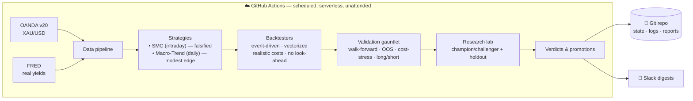

<div align="center">

# 🪙 Gold Quant Lab

### An autonomous, self-validating quantitative research system for spot gold — built to *disprove* its own ideas before trusting them.

*A case study in honest quant research: I took a popular retail strategy, proved with rigorous out-of-sample testing that it has no edge, pivoted to a strategy with real academic support, found a modest genuine edge, and wrapped the whole thing in a guardrailed loop that improves itself without fooling itself.*


</div>

---

## TL;DR for a reviewer

This repository is an end-to-end quantitative trading research platform that runs entirely in the cloud (GitHub Actions), unattended. It demonstrates the full lifecycle a quant desk actually follows:

**hypothesis → faithful implementation → cost-aware event-driven backtest → out-of-sample / walk-forward validation → honest verdict → autonomous, guardrailed iteration.**

Its most important feature is **what it rejects.** It conclusively falsified an intraday Smart-Money-Concepts strategy (no edge after costs), then surfaced a genuinely positive — if modest — edge from a documented risk premium. Every number is produced under strict no-look-ahead accounting and realistic transaction costs, and the system is engineered specifically to resist the overfitting that makes most retail backtests worthless.

---

## What this project demonstrates (skills)

- **Quant research methodology** — walk-forward optimization, in/out-of-sample separation, cost-stress testing, long/short attribution, permanent holdouts, multiple-testing discipline.
- **Backtesting engineering** — an event-driven engine with provable no-look-ahead behavior, realistic spread/slippage modeling, pessimistic intrabar fills, partial profit-taking and ATR trailing; plus a fast vectorized path **proven bar-for-bar equivalent** to the reference implementation.
- **Software engineering** — modular package design, unit tests, a parity test suite, environment-driven config, secret hygiene, CI/CD via GitHub Actions.
- **Data engineering** — OANDA v20 and FRED ingestion, caching, validation, time-zone-correct session logic.
- **Autonomy & MLOps** — a self-improving champion/challenger loop with persistent state, anti-overfitting guardrails, and Slack observability.
- **Intellectual honesty** — the willingness to kill my own strategy when the data said so. (This is the part that matters most.)

---

## The story (why this is worth reading)

**1. The hypothesis.** A TradingView "Gold SMC v8" strategy (displacement candles, fair-value gaps, NY-opening play) looked great on a chart. I ported it faithfully to Python, decoupled from any broker.

**2. The honest test.** Run through an event-driven backtester with realistic costs and strict no-look-ahead accounting, then walk-forward validated on 5 years and 534 out-of-sample trades:

> **Verdict: NO EDGE AFTER COSTS.** Out-of-sample expectancy −0.016R; under a 5× cost-stress the profit factor fell *below 1.0*. The apparent profitability was long-side gold beta plus unrealistically cheap fills — exactly the illusions that kill retail traders.

**3. The pivot.** Instead of curve-fitting the dead strategy, I replaced it with a hypothesis that has decades of academic support: **time-series momentum + a real-yield (TIPS) macro filter + volatility targeting**, on daily bars.

> **Verdict: REAL (MODEST) EDGE.** Out-of-sample Sharpe ≈ 1.7 that **survives 5× costs** — but, reported honestly, the full-sample Sharpe is ≈ 0.5 with a ~36% max drawdown, and recent performance is flattered by gold's 2023–2026 bull run. A real, documented premium — *not* a money machine.

**4. The autonomy.** A weekly research loop now evaluates the champion against pre-registered challengers, confirms any winner on a **permanent holdout it is forbidden to optimize on**, and only promotes after a **3-week confirmation streak** — on the paper track only, never real capital.

---

## Architecture



The backtest and any future live path share **one** signal implementation, so what is tested is exactly what would trade.

---

## Results, reported honestly

| Strategy | Style | Out-of-sample | Cost-stress (5×) | Verdict |
|---|---|---|---|---|
| Gold SMC v8 | Intraday M15 | expectancy −0.016R (534 trades) | PF 0.98 (loses) | ❌ **No edge** |
| Gold Macro-Trend | Daily, TSMOM + real-yield + vol-target | Sharpe ≈ 1.7 | Sharpe ≈ 1.7 (survives) | ✅ **Modest edge** |

*Caveat stated plainly:* the Macro-Trend's full-sample Sharpe is ≈ 0.5 with a ~36% drawdown; its strong out-of-sample window overlaps gold's recent bull market. The honest expectation is a slow, volatile, modest edge that still needs cross-asset confirmation and forward testing.

---

## Engineering highlights

- **No look-ahead, by construction:** signals computed only on closed bars; fills on the *next* bar's open. Verified by a unit-test suite.
- **Parity proof:** the fast vectorized signal path reproduces the reference implementation **bar-for-bar (0 mismatches)**, including indicator warmup edge cases.
- **Realistic costs:** half-spread + adverse slippage on every fill; if a bar touches both stop and target, the **stop** fills first (pessimistic).
- **Anti-overfitting guardrails:** permanent holdout, selection/confirmation separation, multiple-testing penalty, and a multi-week promotion streak.
- **Self-documenting:** every research cycle appends to a version-controlled `research_log.md` and posts a Slack digest.

---

## Repository structure

```
config.py                      Env-driven settings (no secrets committed)
data/
  fetch_oanda.py               Intraday candles (M15/H4)
  fetch_daily.py               Daily candles + FRED real yields
strategy/
  strategy.py · signals.py     SMC reference + parity-proven fast path
  signals_v2.py                + ADX regime filter & event stand-down
  calendar_events.py           FOMC / CPI / NFP calendar
  risk.py · confidence.py      Sizing/stops/targets · 0–100 gate
  macro_trend.py               ✅ Validated Macro-Trend signal
backtest/
  core.py · engine_final.py    Event-driven engine (unit-tested) + wrapper
  engine_v2.py                 + partial profits & ATR trailing
  metrics.py · metrics2.py     Metrics + long/short attribution
  wf.py · validate.py          Walk-forward · full validation pack
  macro_backtest.py            Daily vectorized backtest + verdict
research_lab.py                ✅ Autonomous champion/challenger loop
main.py · validate_run.py · macro_run.py   Orchestrators
execution/notifier.py          Slack client
.github/workflows/             backtest · validate · macro_validate · research
tests/                         Engine unit tests + signal parity proof
research/ · memory/ · reports/ Version-controlled state, logs & verdicts
```

---

## Run it

```bash
pip install -r requirements.txt
cp .env.example .env                 # add OANDA_API_KEY
python data/fetch_daily.py           # daily gold + real yields
python macro_run.py                  # validated strategy + verdict
python research_lab.py               # one autonomous research cycle
```

Cloud (unattended): four scheduled GitHub Actions workflows handle data refresh, backtests, the validation verdict, and the weekly self-improvement cycle — committing results and posting to Slack with no machine left running.

---

## What I'd do next

- Replace the single in/out split with a **rolling** walk-forward for the macro strategy.
- **Cross-asset** confirmation (silver, broad commodities) to prove the premium isn't gold-specific luck.
- Forward (paper) test on new data before any capital is ever considered.
- Monte-Carlo / bootstrap significance testing on the equity curve.

---

## Disclaimer

Educational research on a **paper** account. **Not financial advice.** No strategy here is guaranteed to be profitable. This system exists to test that claim honestly — and it does, even when the answer is *no*.

<div align="center">

*Built with a bias toward truth over hope.*

</div>
