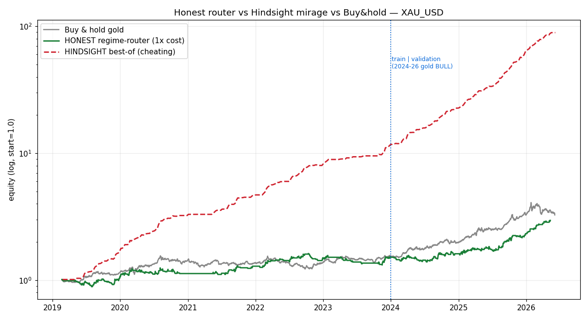

# Honest Regime-Router vs Hindsight Mirage — XAU_USD
_Run 2026-07-25 on real cached data (M15 + daily). Paper/backtest only. I am not a financial
advisor. House rules apply: **selection-period Sharpe is the honest number; every holdout number
below sits inside the 2023–2026 gold bull run and is inflated — labelled BULL wherever it appears.**_

## Bottom line (blunt)
The honest router **passes the promotion gate** on the validation window — **but it does NOT beat
buy-and-hold gold**, and its honest (selection-period) edge is thin and **turns negative at 3×
cost**. Per the rules of engagement (must *both* clear the gate *and* beat buy-and-hold to earn a
paper trial), **it does not qualify. No pre-registration is written. Stopping here.**

Meanwhile the hindsight "best-of" curve looks 5–10× better than anything real — and is a fraud,
because every weekly pick needs the outcome you're trying to predict. That contrast is the whole
point of this report: **a curve's beauty tells you nothing; how the choice was made tells you
everything.**

_Log scale. Grey = buy-and-hold gold. Green = honest router. Red dashed = hindsight best-of.
Over the full window the honest router ends at **2.96×**, buy-and-hold at **3.27×**, hindsight at
**89×**. The router — a complex, long-biased intraday machine — underperformed simply holding gold._

---

## The two strategies, defined as deterministic code (flags, not opinions)

**1. HONEST regime-router (the sound version).**
- **Direction layer (daily):** `fast_trend` = 20/100 EMA + 12-month momentum, vol-targeted at 10%,
  giving the *allowed side only*, read **as-of the prior daily close** (`pos_dir` shifted 1 day — no
  lookahead).
- **Entry layer (M15):** FVG + NY-Opening only (Displacement dropped), confidence gate 60, engine =
  `backtest/engine_final.py`. A trade is taken **only if its side matches the daily allowed side.**
- **Walk-forward:** train ≤ 2023-12 (selection) · validation 2024-01→2026-06 (holdout, BULL).
- 1,587 raw FVG+NY trades → **786 pass the daily-side filter** (686 long / 100 short → **87% long**).

**2. HINDSIGHT best-of (the mirage, built on purpose to expose it).**
- Each week, retrospectively pick whichever component (trend / FVG / NY) *actually* had the best
  realized return, and stitch the winners into one curve. This needs the outcome to make the choice
  — it is uninvestable by construction. Shown only to quantify how badly hindsight flatters a curve.

---

## TASK A — results

### Honest router (all metrics, cost-stressed)
Selection = honest. Holdout = **BULL-inflated, do not take at face value.**

| window | trades | exp (R) | PF | Sharpe | maxDD | quarters + |
|---|---|---|---|---|---|---|
| **selection ≤2023, 1× (HONEST)** | 456 | +0.103 | 1.18 | **0.55** | −19% | 55% |
| selection ≤2023, 3× | 456 | −0.083 | 0.88 | −0.44 | −41% | 35% |
| selection ≤2023, 5× | 456 | −0.269 | 0.68 | −1.39 | −74% | 20% |
| **holdout 2024–26, 1× (BULL)** | 330 | +0.213 | 1.39 | 1.44 | −11% | 90% |
| holdout 2024–26, 3× (BULL) | 330 | +0.114 | 1.19 | 0.77 | −17% | 60% |
| holdout 2024–26, 5× (BULL) | 330 | +0.015 | 1.02 | 0.10 | −32% | 50% |

Read this honestly:
- The **honest number is Sharpe 0.55** (selection, 1× cost) — modest, and it **collapses to −0.44 at
  3× cost**. The per-trade edge (+0.10R) is smaller than a tripled spread. Same cost-fragility flagged
  in `rigorous_backtest_2026-07-22.md`.
- The gorgeous holdout (Sharpe 1.44, 90% of quarters green) is **the 2024–26 gold moon-shot talking**,
  not proof of skill. An 87%-long book in a market that rose +110% will look brilliant.

### Promotion gate (stated explicitly, judged on the validation window @1×)
| criterion | required | actual (validation 1×) | pass |
|---|---|---|---|
| trades | ≥ 100 | 330 | ✅ |
| expectancy | ≥ +0.05R | +0.213R | ✅ |
| profit factor | ≥ 1.15 | 1.39 | ✅ |
| quarters positive | ≥ 60% | 90% | ✅ |

**Gate: PASS** — but see the benchmark below before celebrating. (At 3× cost the gate is marginal;
at 5× it fails on expectancy and quarters.)

### Benchmarks (the reality check the gate alone misses)
| | selection ≤2023 | holdout 2024–26 (BULL) |
|---|---|---|
| **Buy-and-hold gold** — return | +55.9% | **+109.8%** |
| **Buy-and-hold gold** — Sharpe | **0.68** | **1.55** |
| **Honest router** — return | — | +95.2% |
| **Honest router** — Sharpe | 0.55 | 1.44 |

**Buy-and-hold gold beats the router on Sharpe in *both* windows (0.68 vs 0.55; 1.55 vs 1.44) and on
return in the holdout (+110% vs +95%).** The router's one genuine merit is a smaller drawdown
(−11% vs −20% in the holdout) and not being always-in-market — but it does not clear the passive bar.

**Random-side benchmark (1,000 seeds, same entry times, coin-flip side, holdout):** router sim
expectancy **+0.181R** vs random mean **−0.087R** (95th pct −0.04R) → router at the **100th
percentile**. So the router's *direction/timing is genuinely better than random* — there is a real
signal, it is just **not good enough to beat owning gold.** Both things are true.

### Hindsight best-of (the mirage)
| metric | honest avg component | HINDSIGHT best-of |
|---|---|---|
| weekly Sharpe (full) | 0.81 | **5.37** |
| weekly Sharpe (holdout) | — | **7.30** |
| total return (full) | — | **+8,705%** |
| weeks positive | — | 57% |

Cheating turns a real ~0.8 weekly Sharpe into 5–7 and a +8,700% curve. **It is unusable:** picking
"whichever won this week" requires the week's realized result. This is exactly the shape of every
overfit "combination" — stunning in-sample, impossible live. If a proposed combo's curve looks like
the red line, the choice rule is peeking at the answer.

---

## Verdict
- The honest router is a **real but thin, cost-fragile, 87%-long intraday bet** whose flattering
  numbers are gold's bull market. Honest Sharpe 0.55; negative at 3× cost.
- It **passes the gate** yet **loses to buy-and-hold gold** on risk-adjusted *and* raw return. A more
  complicated, more fragile way to be long gold is not an edge worth trialing.
- **Rules of engagement met with a negative result: it does not beat buy-and-hold, so I stop and do
  NOT write a pre-registration.** A negative result is a real result. Nothing is tuned to force a pass.

## TASK B — not triggered
The honest router did not clear the compound bar (gate **and** beat buy-and-hold). **No forward paper
trial is pre-registered.** The live `baseline` champion is untouched; nothing goes near real capital.

If you want a legitimately different question worth testing next, it is the one the benchmarks point
to: **can any gold strategy beat buy-and-hold on a risk-adjusted basis in a *non-bull* regime?** That
requires either out-of-sample down/sideways gold data or an explicitly short-capable, cost-robust
edge — not another long-biased intraday stack measured inside the 2023–26 rally.
